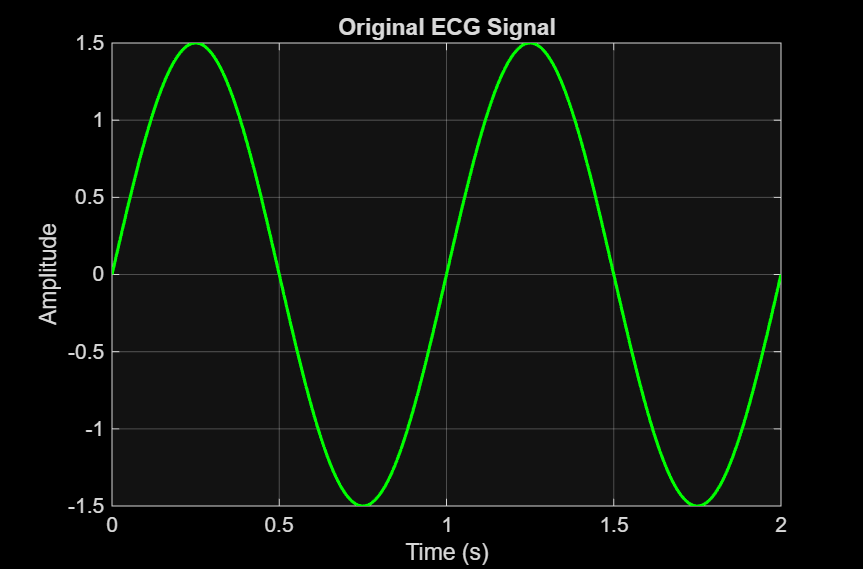
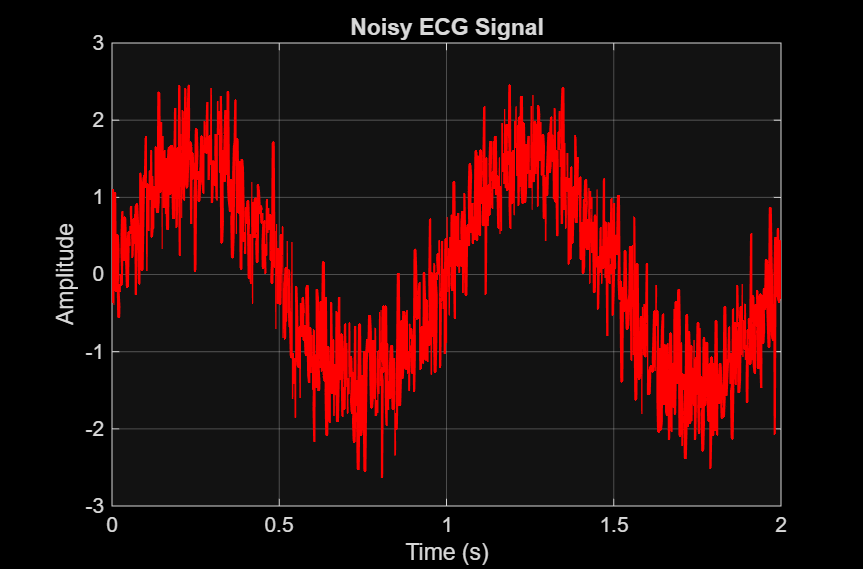
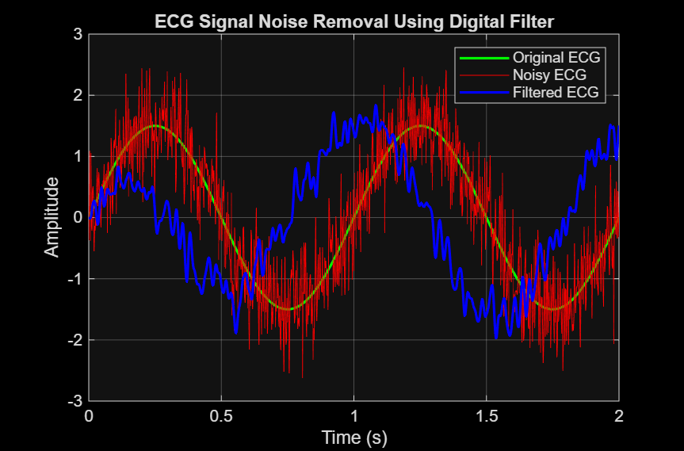

# ECG Noise Removal using MATLAB

## Overview
This project demonstrates ECG signal noise removal using MATLAB.
A synthetic ECG signal is generated, noise is added, and a Butterworth
band-pass digital filter is applied to obtain a clean ECG signal.

---

## Methodology
- ECG signal generation
- Noise addition
- Butterworth band-pass filtering
- Performance analysis using plots

---

## Results

### Original ECG Signal

### Noisy ECG Signal

### Filtered ECG Signal

---

## Files
- `ECG_Noise_Removal.m` – MATLAB script
- `Filtered_ECG_Data.csv` – Filtered ECG values

---

## How to Run
1. Open `ECG_Noise_Removal.m` in MATLAB  
2. Run the script  
3. Observe ECG plots and filtering results  

---

## Skills Demonstrated
- MATLAB Programming  
- Digital Signal Processing  
- Digital Filters (Butterworth)  
- Biomedical Signal Processing  
